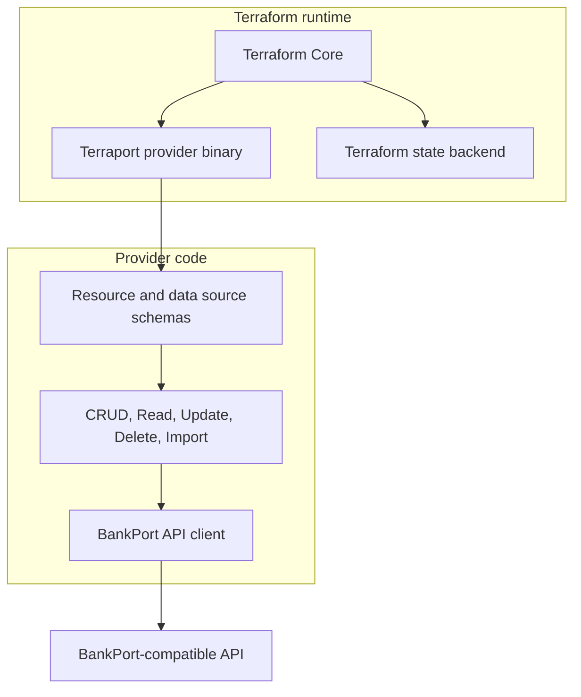

# C4 Container

```mermaid
flowchart TB
  subgraph Terraform["Terraform runtime"]
    Core["Terraform Core"]
    Provider["Terraport provider binary"]
    State["Terraform state backend"]
  end
  subgraph ProviderCode["Provider code"]
    Schemas["Resource and data source schemas"]
    Lifecycle["CRUD, Read, Update, Delete, Import"]
    Client["BankPort API client"]
  end
  API["BankPort-compatible API"]
  Core --> Provider
  Provider --> Schemas
  Schemas --> Lifecycle
  Lifecycle --> Client
  Client --> API
  Core --> State
```

The provider binary is stateless between Terraform operations. Caching is intentionally not introduced because stale provider-local caches would hide remote drift.
