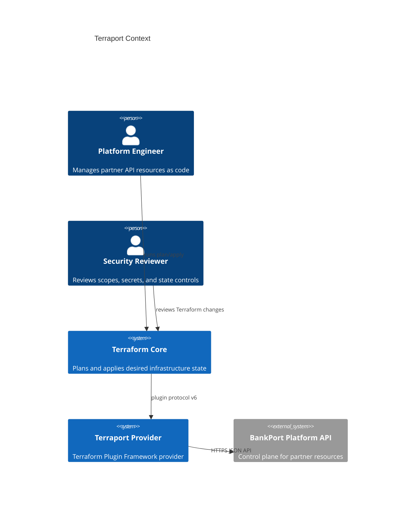

# C4 Context

```mermaid
C4Context
  title Terraport Context
  Person(platform, "Platform Engineer", "Manages partner API resources as code")
  Person(security, "Security Reviewer", "Reviews scopes, secrets, and state controls")
  System(terraform, "Terraform Core", "Plans and applies desired infrastructure state")
  System(provider, "Terraport Provider", "Terraform Plugin Framework provider")
  System_Ext(bankport, "BankPort Platform API", "Control plane for partner resources")
  Rel(platform, terraform, "runs plan/apply")
  Rel(security, terraform, "reviews Terraform changes")
  Rel(terraform, provider, "plugin protocol v6")
  Rel(provider, bankport, "HTTPS JSON API")
```
