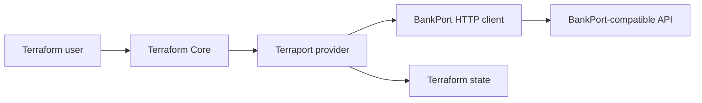

# Architecture Overview

Terraport is a Terraform provider process. Terraform Core loads it through the Plugin Framework protocol and calls provider configure, data source read, and resource lifecycle methods.

## Main Boundaries

- `internal/provider`: Terraform schemas, lifecycle mapping, import, diagnostics.
- `internal/bankport`: HTTP transport, retry policy, timeout policy, API types.
- `internal/provider/*_test.go`: fake API acceptance tests using Terraform Plugin Testing.

The provider has no database and no background process. Remote API state is the system of record; Terraform state is used to plan and refresh.
