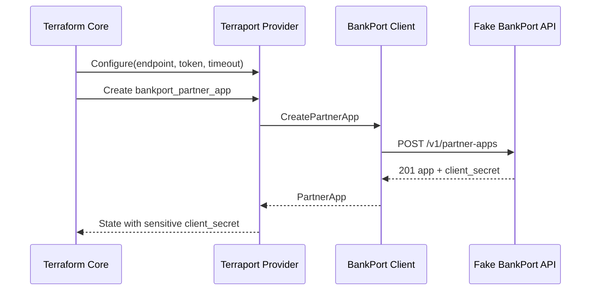
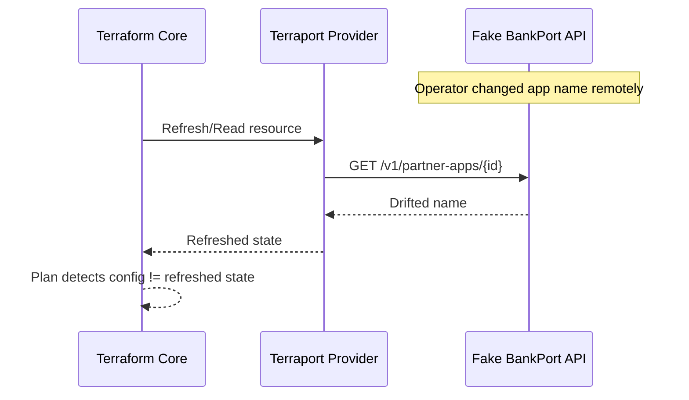

# Sequence Diagrams

## Create Partner App

```mermaid
sequenceDiagram
  participant TF as Terraform Core
  participant Provider as Terraport Provider
  participant Client as BankPort Client
  participant API as Fake BankPort API
  TF->>Provider: Configure(endpoint, token, timeout)
  TF->>Provider: Create bankport_partner_app
  Provider->>Client: CreatePartnerApp
  Client->>API: POST /v1/partner-apps
  API-->>Client: 201 app + client_secret
  Client-->>Provider: PartnerApp
  Provider-->>TF: State with sensitive client_secret
```

## Drift Detection

```mermaid
sequenceDiagram
  participant TF as Terraform Core
  participant Provider as Terraport Provider
  participant API as Fake BankPort API
  Note over API: Operator changed app name remotely
  TF->>Provider: Refresh/Read resource
  Provider->>API: GET /v1/partner-apps/{id}
  API-->>Provider: Drifted name
  Provider-->>TF: Refreshed state
  TF-->>TF: Plan detects config != refreshed state
```
