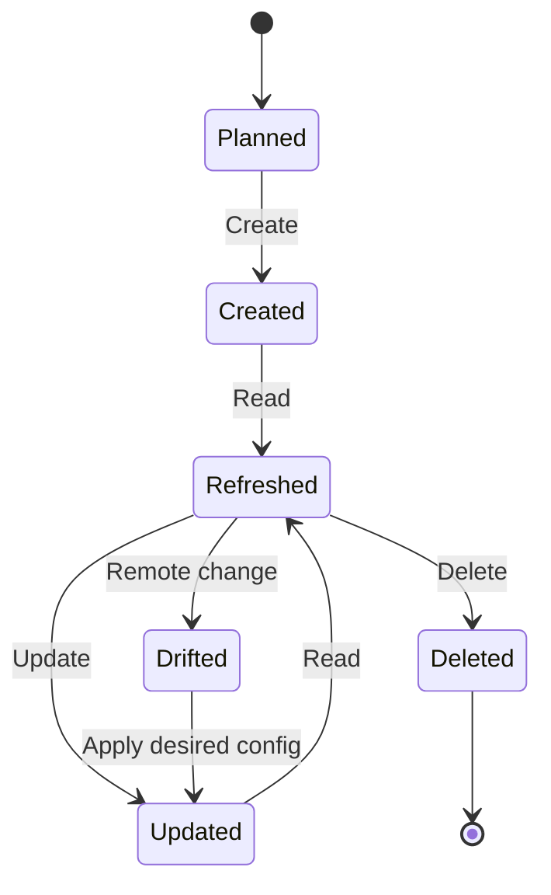
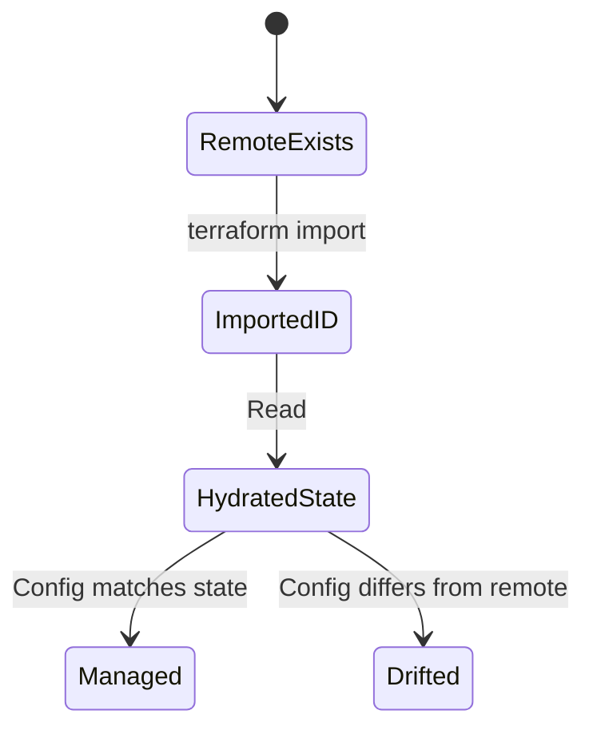
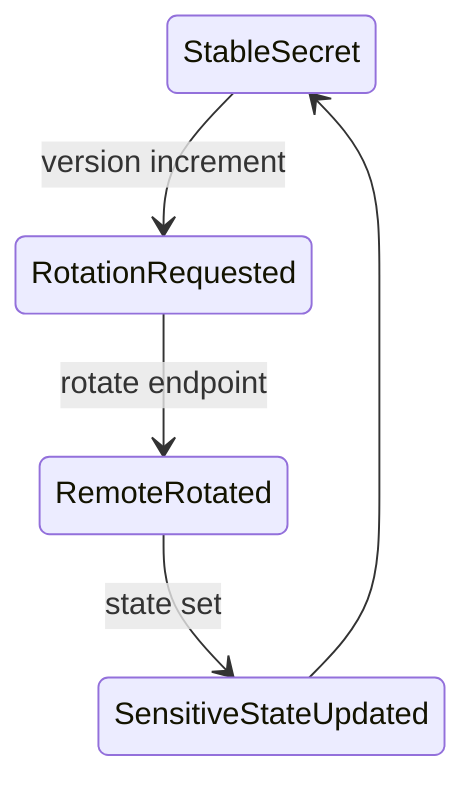

# State Machines

## Managed Resource Lifecycle

```mermaid
stateDiagram-v2
  [*] --> Planned
  Planned --> Created: Create
  Created --> Refreshed: Read
  Refreshed --> Updated: Update
  Updated --> Refreshed: Read
  Refreshed --> Drifted: Remote change
  Drifted --> Updated: Apply desired config
  Refreshed --> Deleted: Delete
  Deleted --> [*]
```

## Import Lifecycle

```mermaid
stateDiagram-v2
  [*] --> RemoteExists
  RemoteExists --> ImportedID: terraform import
  ImportedID --> HydratedState: Read
  HydratedState --> Managed: Config matches state
  HydratedState --> Drifted: Config differs from remote
```

## Secret Rotation

```mermaid
stateDiagram-v2
  StableSecret --> RotationRequested: version increment
  RotationRequested --> RemoteRotated: rotate endpoint
  RemoteRotated --> SensitiveStateUpdated: state set
  SensitiveStateUpdated --> StableSecret
```
